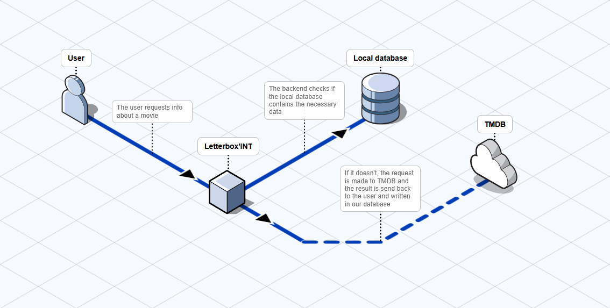
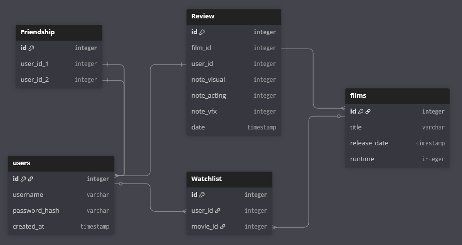

```
██╗     ███████╗████████╗████████╗███████╗██████╗ ██████╗  ██████╗ ██╗  ██╗██╗██╗███╗   ██╗████████╗
██║     ██╔════╝╚══██╔══╝╚══██╔══╝██╔════╝██╔══██╗██╔══██╗██╔═══██╗╚██╗██╔╝╚═╝██║████╗  ██║╚══██╔══╝
██║     █████╗     ██║      ██║   █████╗  ██████╔╝██████╔╝██║   ██║ ╚███╔╝    ██║██╔██╗ ██║   ██║   
██║     ██╔══╝     ██║      ██║   ██╔══╝  ██╔══██╗██╔══██╗██║   ██║ ██╔██╗    ██║██║╚██╗██║   ██║   
███████╗███████╗   ██║      ██║   ███████╗██║  ██║██████╔╝╚██████╔╝██╔╝ ██╗   ██║██║ ╚████║   ██║   
╚══════╝╚══════╝   ╚═╝      ╚═╝   ╚══════╝╚═╝  ╚═╝╚═════╝  ╚═════╝ ╚═╝  ╚═╝   ╚═╝╚═╝  ╚═══╝   ╚═╝   
```                                                                                             
                                                                                                 
# The Project

Letterbox'INT is a web-based social network dedicated to film enthusiasts, inspired by the popular platform Letterboxd. Developed as a school project, this application allows users to track their film journey, discover new movies, and share their opinions with a community of peers.

Whether you are a casual moviegoer or a hardcore cinephile, Letterbox'INT provides the tools to log what you watch and find out what's trending on campus.

# Features

Log & Rate: Keep a diary of every film you watch and rate them on our innovative 3-mark system.

Reviews: Write in-depth reviews and read what others think.

Watchlist: Save movies you want to see for later.

Social Graph: Follow friends to see their latest reviews.

Discovery: Browse movies by genre, popularity, or rating.

# Architecture

The system is divided into three main layers:

Frontend: A responsive user interface handling user interactions and state management.

Backend API: A RESTful API handling logic and authentication.

Data Layer: Persistent storage for user data and movie metadata.

## Tech stack used

- MySQL
- Python fastapi backend
- React

## Data flow



## Database structure



## API Endpoints

- `GET /api/movie` to get infos about a movie
- `POST /api/movie` to update infos of a movie in the DB
- `GET /api/user` to get a user's main info
- `GET /api/watchlist` to get a watchlist
- `GET /api/review` to get a review

# Meet the team

- Goessens Louis
- Jacques-Yonyul Aurélien
- Nussbaumer Hector
- Riedel Nicolas
- Schauli Pierre

Made with ❤️ by the Letterbox'INT team